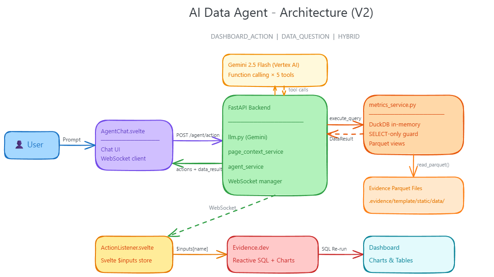

# AI-Driven Evidence Dashboard

An AI agent embedded in an [Evidence.dev](https://evidence.dev) dashboard. The agent accepts natural language via a chat widget and uses **Gemini 2.5 Flash** (Vertex AI) with structured function calling to control the dashboard and answer data questions — **no browser automation**.

## Architecture



See [`docs/architecture.excalidraw`](docs/architecture.excalidraw) for the editable source.

### Three Intent Types

| Intent | What the agent does |
|--------|---------------------|
| **DASHBOARD_ACTION** | Calls `set_filters`, `clear_filters`, `navigate`, or `export` → updates Evidence `$inputs` store via WebSocket |
| **DATA_QUESTION** | Calls `execute_query` → runs SELECT SQL on Evidence parquet files via DuckDB → returns answer in chat |
| **HYBRID** | Calls both in a single Gemini response — filters the dashboard AND answers the data question simultaneously |

### Data Flow

```
User prompt
  └─► AgentChat.svelte ──HTTP POST /agent/action──► FastAPI Backend
                                                       ├─ page_context_service (loads page JSON)
                                                       └─ llm.py → Gemini 2.5 Flash
                                                            ├─ DASHBOARD_ACTION tools
                                                            │    └─ WebSocket → ActionListener.svelte
                                                            │         └─ $inputs store → Evidence SQL re-runs → Charts
                                                            └─ execute_query tool
                                                                 └─ metrics_service (DuckDB in-memory)
                                                                      └─ read_parquet() → DataResult → chat table
```

**Key design**: Evidence.dev's `<Dropdown>` components share a Svelte context store (`$inputs[name]`). `ActionListener.svelte` writes directly to this store — the same mechanism Dropdowns use internally — triggering instant reactive updates without page reloads or DOM manipulation.

## Directory Structure

```
/ai-data-agent
├── /backend
│   ├── app/
│   │   ├── core/
│   │   │   ├── config.py            # Pydantic Settings (.env loader)
│   │   │   ├── constants.py         # Allow-lists for actions, fields, pages
│   │   │   └── llm.py               # Gemini client, 5 tool declarations, process_prompt()
│   │   ├── models/
│   │   │   ├── actions.py           # FilterItem, Set/Clear/Navigate/Export actions
│   │   │   ├── data.py              # DataResult (sql, columns, rows, summary)
│   │   │   └── api.py               # AgentRequest, AgentResponse
│   │   ├── services/
│   │   │   ├── agent_service.py     # Action validation + confirmation messages
│   │   │   ├── metrics_service.py   # Safe DuckDB executor over Evidence parquet files
│   │   │   ├── page_context_service.py  # Load page JSON → LLM context text
│   │   │   └── websocket_manager.py # WebSocket connection broadcasting
│   │   └── main.py                  # FastAPI app + endpoints
│   ├── requirements.txt
│   └── .env
├── /frontend
│   ├── /components
│   │   ├── AgentChat.svelte         # Chat widget — sends prompt + page name, renders data tables
│   │   └── ActionListener.svelte    # Svelte context bridge → $inputs store
│   ├── /pages
│   │   ├── +layout.svelte           # Evidence layout + AgentChat mount
│   │   └── index.md                 # Dashboard with category/year filters
│   ├── /sources
│   │   └── needful_things/          # DuckDB sample data source
│   └── parse_pages.py               # Extracts SQL queries + filters from pages → JSON
├── /docs
│   ├── architecture.png             # Architecture diagram (exported)
│   └── architecture.excalidraw      # Editable Excalidraw source
└── .gitignore
```

## Supported Intents (V2)

### Dashboard Actions

| Action | Description | Example Prompt |
|--------|-------------|----------------|
| `set_filters` | Apply filters to Dropdown inputs | `"Filter for Clothing category"` |
| `clear_filters` | Reset filters to wildcard | `"Clear all filters"` |
| `navigate` | Go to a different page | `"Go to settings"` |
| `export` | Download visible data | `"Export as CSV"` |

### Data Questions

| Example Prompt | What Happens |
|----------------|-------------|
| `"What is the total revenue?"` | Runs `SELECT SUM(sales)` → returns total in chat |
| `"Which category has the highest sales?"` | Runs GROUP BY query → returns ranked table |
| `"Show top 5 months by revenue"` | Returns aggregated monthly table |

### Hybrid (filter + answer)

| Example Prompt | What Happens |
|----------------|-------------|
| `"What is the total revenue in 2020?"` | Sets year=2020 on dashboard **and** returns 2020 total |
| `"What was the best month in 2021?"` | Sets year=2021 **and** returns top month |

## Prerequisites

| Tool | Version |
|------|---------|
| Python | 3.10+ |
| Node.js | 18+ |
| npm | 9+ |
| Google Cloud CLI (`gcloud`) | latest |

## Setup

### 1. Authenticate with Google Cloud

```bash
gcloud auth application-default login
```

### 2. Configure Environment

Edit `backend/.env`:

```env
GCP_PROJECT_ID=my-gcp-project
GCP_REGION=us-central1
GEMINI_MODEL=gemini-2.5-flash
```

### 3. Generate Page Descriptions

Run once from `frontend/` (re-run whenever you edit pages):

```bash
cd ai-data-agent/frontend
python parse_pages.py
```

### 4. Generate Evidence Parquet Files

Run once from `frontend/` (re-run whenever data changes):

```bash
cd ai-data-agent/frontend
npx evidence sources
```

### 5. Install & Run the Backend

```bash
cd ai-data-agent/backend

python -m venv .venv
# Windows
.venv\Scripts\activate
# macOS / Linux
source .venv/bin/activate

pip install -r requirements.txt
uvicorn app.main:app --host 0.0.0.0 --port 4000 --reload
```

### 6. Install & Run the Evidence Frontend

```bash
cd ai-data-agent/frontend
npm install
npx evidence dev
```

The dashboard will be available at **http://localhost:3000**.

## Usage

1. Open the dashboard at `http://localhost:3000`.
2. Click the **chat bubble** in the bottom-right corner.
3. Type a prompt and press **Enter**.

## License

MIT
